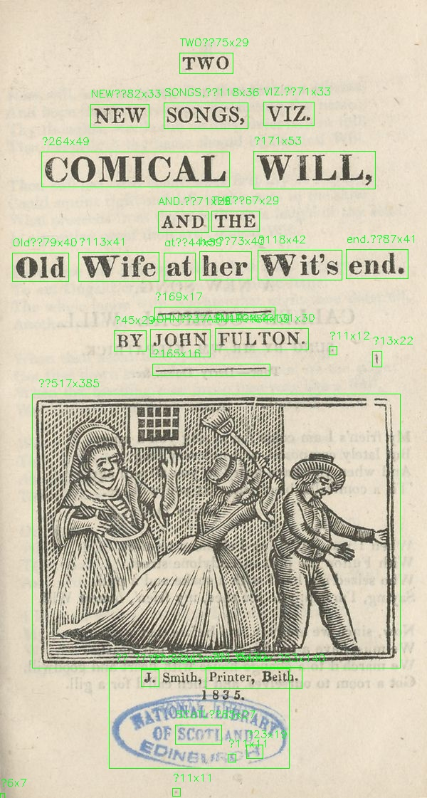
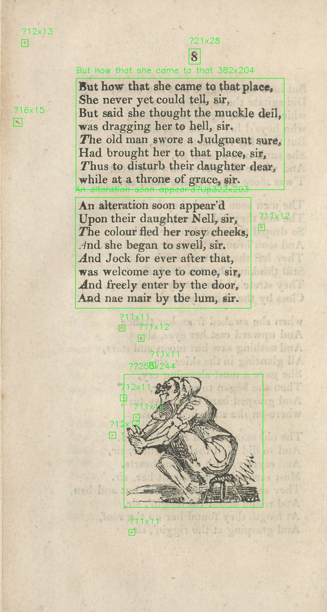

# Dev Log 1

## Project Objective
+ Explore the *images* contained within the NLS collection of [Scottish Chapbooks](https://data.nls.uk/data/digitised-collections/chapbooks-printed-in-scotland/)
	+ Lots of text analysis done on this collection but the pictures are underrated
	+ Chapbooks an expression of societal values/popular culture of the majority in 17th to 19th century Scotland
		+ What can we learn about those consuming these images through what the images contain?
		+ What can we learn about how those depicted in the images were percieved by the majority? 

+ Outline of what must be done:
	+ Gathering data
		+ Run all pages from data set through image detection to pull only the pages which actually contain illustrations
		+ OCR illustrated pages for included text to associate with image to contextualize it
		+ I kind of want metadata too... --> use inventory CSV to locate chapbook's actual archive and scrape data from there?
			+ [Browse by shelfmark](https://www.nls.uk/collections/rare-books/collections/chapbooks/) 
	+ Analysis
		+ Run through PixPlot to see what categorizations it comes up with
			+ Plot images by date?
		+ Perhaps some GAN based on PixPlot categorizations

## Image Detection
+ Will start by working with the trial data --> I literally do not have enough room on my laptop to download the full dataset
+  First will try pre-built object detection using `ImageAI` library in Python --> hoping the images will be detected as objects
	+ Of course, this does not detect anything when applied to woodblock prints --> was hoping for at least a "misc" object
+ Time to use good ol fashion OpenCV then
	+ GeeksforGeeks saving me since undergrad --> [tutorial on both OpenCV *AND* OCR!](https://www.geeksforgeeks.org/text-detection-and-extraction-using-opencv-and-ocr/)
	+ Image is detected (along with rest of the page contents as seen below) --> now how do I just extract the image?
	
	
	+ What if I reverse OCR --> section put through tesseract that *doesn't* result in any text output is cropped and saved because this likely indicates that it's an illustration
		+ ...or a random fragment of the page --> manual clean up?
			+ I can up the kernal size so fewer page imperfections are extracted --> after I can just open output folder and sort by file size bc images will be largest
		+ Annnd testing with `107134018.3.jpg` fails, image is not pulled --> annotated detected sections and there is still seemingly no text detected?
			+ Ah ha for some reason the image is *multiple* spaces instead of the usual single space I'm looking for
			+ I forgot about the `isspace()` method in python --> using this results in the image being extracted!
		+ Nope once again: `107133934.3.jpg` fails because some text is included in the area captured
	+ Extract images based on size of `boundingRect` around contour?
		+ Check is now 
		+ Okay this finds images successfully without grabbing the tiny fragments --> also captures paragraphs of text though so maybe I should reduce kernel size?
		+ Reducing kernel size to (11,11) --> paragraphs still captured but no additional text in images...
	+ Will do 2 rounds of processing images to find pages that contain woodblock prints
		+ Round 1 as stated above
		+ Round 2 will be using original OCR method to check recently outputted image crops for any text --> if yes, ignore, if no add image to list
			+ Could in theory do both these check in one step but I want to be able to check the data between steps to see how it's working

## Thoughts on where to go next
+ Technical steps to fully wrangle image data:
	+ Download full dataset and combine all image folders into one large one
	+ Processing #1: Loop through each image in folder to find and crop large areas of the scans
	+ Processing #2: Loop through new folder of crops and check for text --> if no text then ignore
	+ Match remaining woodblocks to corresponding full pages using filename 
	+ BOOM inventory of pages with images? I hope??
+  At some point I'll train an object detection model or image classifer with the extracted images to make creating data sets like this easier in the future 
	+  Good reference point: [LoC newspaper-navigator](https://github.com/LibraryOfCongress/newspaper-navigator)